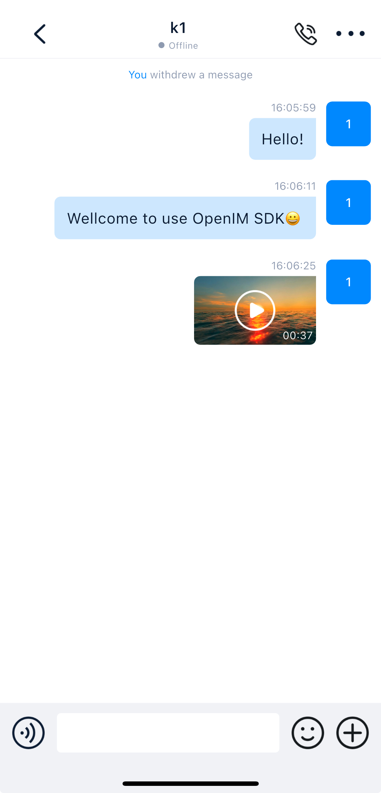

<p align="center">
    <a href="https://openim.io">
        
    </a>
</p>

# OpenIM Flutter 💬💻

<p>
  <a href="https://docs.openim.io/">OpenIM Docs</a>
  •
  <a href="https://github.com/openimsdk/open-im-server">OpenIM Server</a>
  •
  <a href="https://github.com/openimsdk/open-im-sdk-flutter">openim-sdk-flutter</a>
  •
  <a href="https://github.com/openimsdk/openim-sdk-core">openim-sdk-core</a>
</p>

OpenIM provides an open-source Instant Messaging (IM) SDK for developers, serving as an alternative solution to cloud services like Twilio and Sendbird. With OpenIM, developers can build secure and reliable IM applications similar to WeChat, Zoom, and Slack.

This repository is based on the open-source version of the OpenIM SDK, offering an Flutter IM application. You can use this application as a reference implementation of the OpenIM SDK.

<p align="center">
   
   <span style="display: inline-block; width: 16px;"></span>
   
</p>

## License :page_facing_up:

This repository is licensed under the GNU Affero General Public License Version 3 (AGPL-3.0) and is subject to additional terms. **Commercial use is prohibited**. For more details, see [here](./LICENSE).

## Development Environment

Before you start development, ensure that the following software is installed on your system:

- **Operating System**: macOS 14.6 or later
- **Flutter**: Version 3.24.5 ([Installation Guide](https://docs.flutter.dev/get-started/install))
- **Git**: For version control

Additionally, make sure you have [deployed](https://docs.openim.io/zh-Hans/guides/gettingStarted/dockerCompose) the latest version of the OpenIM Server. After deployment, you can compile the project and connect it to your server for testing.

## Supported Platforms

This application supports the following platforms:

| Platform      | Version               | Status |
| ------------- | --------------------- | ------ |
| **iOS**       | 13.0 and above        | ✅     |
| **Android**   | minSdkVersion 24      | ✅     |

### Notes

- **Flutter**: Ensure your version meets the requirements to avoid dependency issues.

## Quick Start

Follow the steps below to set up your local development environment:

1. Clone the repository:

   ```bash
   git clone https://github.com/openimsdk/open-im-flutter-demo.git
   cd open-im-flutter-demo
   ```

2. Install dependencies

   ```bash
   flutter clean
   flutter pub get
   ```

3. Modify the configuration

     > If you have not changed the default server ports, update only the [_host](https://github.com/openimsdk/open-im-flutter-demo/blob/a309f25fdbc143e49d5ca852171ce57970871c85/openim_common/lib/src/config.dart#L59) to your server IP.

   ```dart
   static const _host = "your-server-ip/domain";
   ```

4. Run the application using `flutter run` from the terminal or through your IDE.

5. Start developing and testing! 🎉

## Audio/Video Calls

The open-source version supports one-to-one audio and video calls. You need to first deploy and configure the [server](https://github.com/openimsdk/chat/blob/main/HOW_TO_SETUP_LIVEKIT_SERVER.md). For multi-party audio/video calls or video conferencing, please contact us at [contact@openim.io](mailto:contact@openim.io).

## Build 🚀

> This project allows building separate iOS and Android applications with some differences in the process.

   - iOS:
     ```bash
     flutter build ipa
     ```
   - Android:
     ```bash
     flutter build apk
     ```

1. The build artifacts will be located in the `build` directory.

## Features

### Description

| Feature Module             | Feature                                                                          | Status |
| -------------------------- | -------------------------------------------------------------------------------- | ------ |
| **Account Features**       | Phone number registration \ Email registration \ Verification code login         | ✅     |
|                            | View \ Edit personal information                                                 | ✅     |
|                            | Multi-language settings                                                          | ✅     |
|                            | Change password \ Forgot password                                                | ✅     |
| **Friend Features**        | Find \ Apply \ Search \ Add \ Delete friends                                     | ✅     |
|                            | Accept \ Reject friend requests                                                  | ✅     |
|                            | Friend notes                                                                     | ✅     |
|                            | Allow friend requests or not                                                     | ✅     |
|                            | Friend list \ Friend data real-time syncing                                      | ✅     |
| **Blocklist**              | Restrict messages                                                                | ✅     |
|                            | Real-time syncing of blocklist                                                   | ✅     |
|                            | Add \ Remove from blocklist                                                      | ✅     |
| **Group Features**         | Create \ Dismiss groups                                                          | ✅     |
|                            | Apply to join \ Invite to join \ Leave group \ Remove members                    | ✅     |
|                            | Group name / Avatar changes / Group data updates (notifications, real-time sync) | ✅     |
|                            | Invite members to group                                                          | ✅     |
|                            | Transfer group ownership                                                         | ✅     |
|                            | Group owner or admin approve join requests                                       | ✅     |
|                            | Search group members                                                             | ✅     |
| **Message Features**       | Offline messages                                                                 | ✅     |
|                            | Roaming messages                                                                 | ✅     |
|                            | Multi-end messages                                                               | ✅     |
|                            | Message history                                                                  | ✅     |
|                            | Message deletion                                                                 | ✅     |
|                            | Clear messages                                                                   | ✅     |
|                            | Copy messages                                                                    | ✅     |
|                            | Typing indicator in single chat                                                  | ✅     |
|                            | Do Not Disturb for new messages                                                  | ✅     |
|                            | Clear chat history                                                               | ✅     |
|                            | New members can view group chat history                                          | ✅     |
|                            | New message reminders                                                            | ✅     |
|                            | Text messages                                                                    | ✅     |
|                            | Image messages                                                                   | ✅     |
|                            | Video messages                                                                   | ✅     |
|                            | Emoji messages                                                                   | ✅     |
|                            | File messages                                                                    | ✅     |
|                            | Voice messages                                                                   | ✅     |
|                            | Contact card messages                                                            | ✅     |
|                            | Location messages                                                                | ✅     |
|                            | Custom messages                                                                  | ✅     |
| **Conversation**           | Pin conversation                                                                 | ✅     |
|                            | Mark conversation as read                                                        | ✅     |
|                            | Mute conversation                                                                | ✅     |
| **REST API**               | Authentication management                                                        | ✅     |
|                            | User management                                                                  | ✅     |
|                            | Relationship chain management                                                    | ✅     |
|                            | Group management                                                                 | ✅     |
|                            | Conversation management                                                          | ✅     |
|                            | Message management                                                               | ✅     |
| **Webhook**                | Group callbacks                                                                  | ✅     |
|                            | Message callbacks                                                                | ✅     |
|                            | Push callbacks                                                                   | ✅     |
|                            | Relationship callbacks                                                           | ✅     |
|                            | User callbacks                                                                   | ✅     |
| **Capacity & Performance** | 10,000 friends                                                                   | ✅     |
|                            | 100,000-member supergroup                                                        | ✅     |
|                            | Second-level syncing                                                             | ✅     |
|                            | Cluster deployment                                                               | ✅     |
|                            | Multi-device kick-out strategy                                                   |        |
| **Online Status**          | No mutual kick-out across all platforms                                          | ✅     |
|                            | Each platform can only log in with one device                                    | ✅     |
|                            | PC, Mobile, Pad, Web, Mini Program each can log in with one device               | ✅     |
|                            | PC not mutually kicked, only one device total for other platforms                | ✅     |
| **Audio/Video Call**       | One-to-one audio and video calls                                                 | ✅     |
| **File Storage**           | Supports private Minio deployment                                                | ✅     |
|                            | Supports public cloud services COS, OSS, Kodo, S3                                | ✅     |
| **Push**                   | Real-time online message push                                                    | ✅     |
|                            | Offline message push, supports Getui, Firebase                                   | ✅     |

For more advanced features, audio/video calls, or video conferences, please contact us at [contact@openim.io](mailto:contact@openim.io).

## Join Our Community :busts_in_silhouette:

- 🚀 [Join our Slack community](https://join.slack.com/t/openimsdk/shared_invite/zt-22720d66b-o_FvKxMTGXtcnnnHiMqe9Q)
- :eyes: [Join our WeChat group](https://openim-1253691595.cos.ap-nanjing.myqcloud.com/WechatIMG20.jpeg)

## FAQ

##### 1. Does it support multiple languages?

A: Support, follow the system language by default

##### 2. Which platforms are supported?

A: The demo currently supports android and ios.

##### 3. The debug of the android installation package can run, but the release starts with a white screen?

A: The release package of flutter is obfuscated by default. You can use the command: flutter build release --no -shrink. If this command is invalid, you can do the following

Add the following configuration to the release configuration configured in android/app/build.gradle

```
release {
    minifyEnabled false
    useProguard false
    shrinkResources false
}
```

##### 4. What should I do if the code must be confused?

A: Add the following rules to the obfuscation rules

```
-keep class io.openim.**{*;}
-keep class open_im_sdk.**{*;}
-keep class open_im_sdk_callback.**{*;}
```

##### 5. The android installation package cannot be installed on the emulator?

A: Because the Demo has removed some cpu architectures, if you want to run it on the emulator, please do the following:

Add in android/build.gradle configuration

```
ndk {
    abiFilters "armeabi-v7a",  "x86"
}
```

##### 6, ios run/build release package error

A: Please set the CPU architecture to arm64, and then operate as follows

- flutter clean
- flutter pub get
- cd ios
- rm -f Podfile.lock
- rm -rf Pods
- pod install
- Run Archive after connecting to the real device


##### 7. What is the minimum version number for ios to run?

A: 13.0
