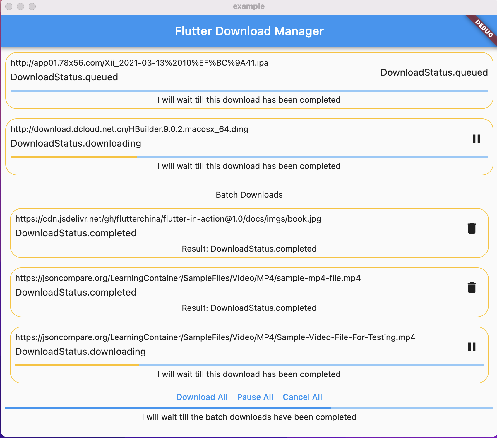

Flutter Download Manager
===========

[](https://pub.dev/packages/flutter_download_manager)
[](https://pub.dev/packages/flutter_download_manager/score)
[](https://pub.dev/packages/flutter_download_manager/score)
[](https://pub.dev/packages/flutter_download_manager/score) |

Overview
========
Flutter Download Manager is a Cross-Platform file downloader with Parallel and Batch Download support. Manage download tasks by url and be notified of status and their progress. Pause, Cancel, Queue and Resume Downloads. 

This package was made as I felt like there are no download managers in flutter, specially with desktop support. 



## Features

* Manage download tasks by url
* Ability to notified of status and progress changes
* Partial Download Feature
* Queue Downloads
* Pause, Cancel or Resume Downloads
* Parallel File Downloads (2 or can change)
* Support Batch download

## Platforms Supported

- Linux
- MacOS
- Windows
- Android 
- iOS

There are a few caveats about this package:
- On desktop it saves the file in absolute or relative path.
- On mobile it saves the file in absolute or relative path, but we should ask/ensure if the app has the required permissions.
- It does not run in a background process, so when the dart application closes the manager will also shut down.

## Getting Started

In your `pubspec.yaml` file add:

```dart
dependencies:
  flutter_download_manager: any
```
Then, in your code import:
```dart
import 'package:flutter_download_manager/flutter_download_manager.dart';
```

## Usage

Please refer to `/example` folder for a working example.

### Simply Download a file

```dart
var dl = DownloadManager();
var url = "adasdad.com/asda.sdas";
dl.addDownload(url, "./test.sdas");

DownloadTask? task = dl.getDownload(url4);

task?.status.addListener(() {
  print(task.status.value);
});

task?.progress.addListener(() {
  print(task.progress.value);
});

await dl.whenDownloadComplete(url4);
```

### Get Download Status


```dart
DownloadTask? task = dl.getDownload(url4);

task?.status.addListener(() {
  print(task.status.value);
});
```
### Get Download Progress


```dart
DownloadTask? task = dl.getDownload(url4);

task?.progress.addListener(() {
  print(task.progress.value);
});
```

### Await for a task to be complete

```dart
DownloadTask? task = dl.getDownload(url4);

await task.whenDownloadComplete();
```

### Cancel a task

  ```dart
var dl = DownloadManager();

dl.cancelDownload(url5);
```

### Pause a task

  ```dart
var dl = DownloadManager();

dl.pauseDownload(url5);
```

### Resume a task

  ```dart
var dl = DownloadManager();

dl.resumeDownload(url5);
```

### Download in Batch

```dart
var dl = DownloadManager();

var urls = <String>[];
urls.add(url2);
urls.add(url3);
urls.add(url);

dl.addDownload(url2, "./test2.ipa");
dl.addDownload(url3, "./test3.ipa");
dl.addDownload(url, "./test.ipa");

var downloadProgress = dl.getDownloadProgress(urls);

downloadProgress.addListener(() {
  print(downloadProgress.value);
});

await dl.whenDownloadsComplete(urls);
```

```dart
var dl = DownloadManager();

var urls = <String>[];
urls.add(url2);
urls.add(url3);
urls.add(url);

dl.addBatchDownloads(urls, "./");
```

### Cancel a Batch Download

  ```dart
var dl = DownloadManager();

var urls = <String>[];
urls.add(url6);
urls.add(url5);
urls.add(url);

dl.cancelDownloads(urls);
```
### Get Batch Download Progress

```dart
var dl = DownloadManager();

var urls = <String>[];
urls.add(url2);
urls.add(url3);

var downloadProgress = dl.getDownloadProgress(urls);

downloadProgress.addListener(() {
  print(downloadProgress.value);
});
```

### Await for Batch Download to complete

```dart
var dl = DownloadManager();

var urls = <String>[];
urls.add(url2);
urls.add(url3);
urls.add(url);

await dl.whenDownloadsComplete(urls);
```

## Future Work

[] Add in Shared Preference to survive app shutdown

# DownloadStatus

enum DownloadStatus { queued, downloading, completed, failed, paused, canceled }
